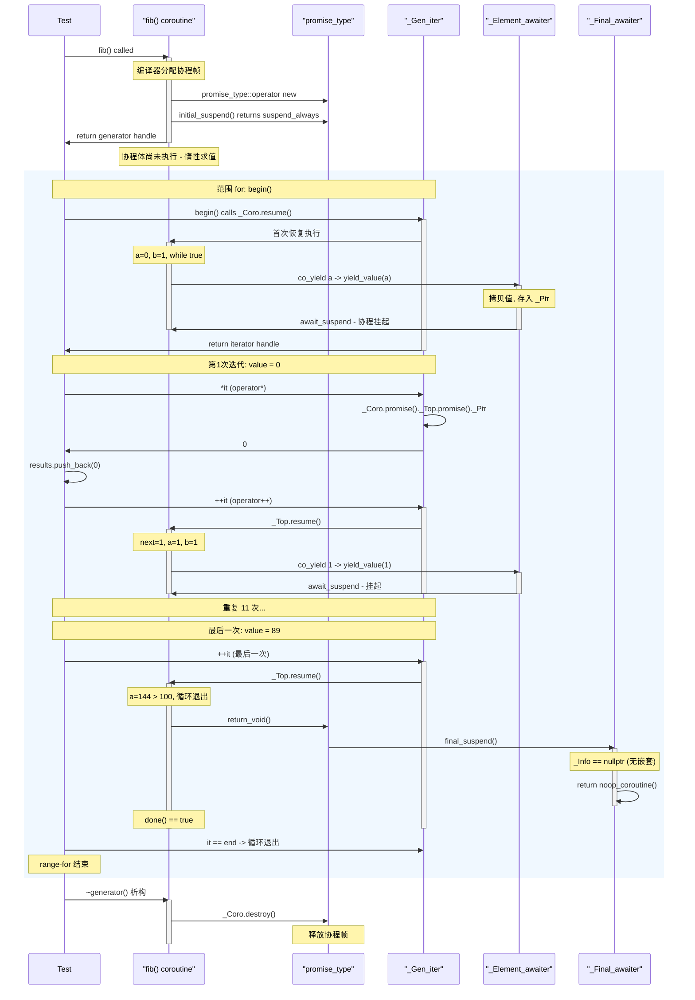
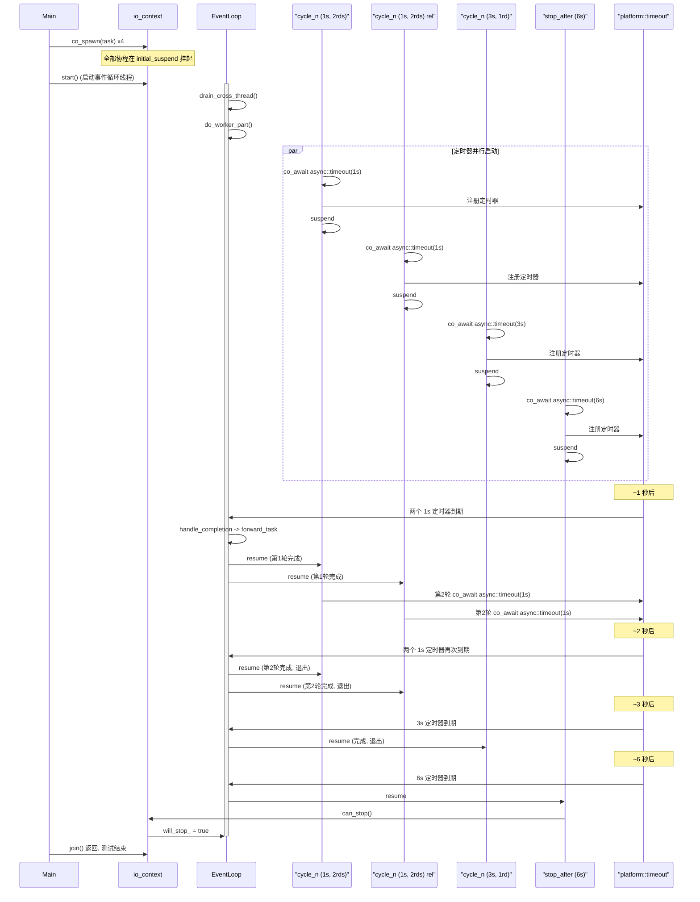
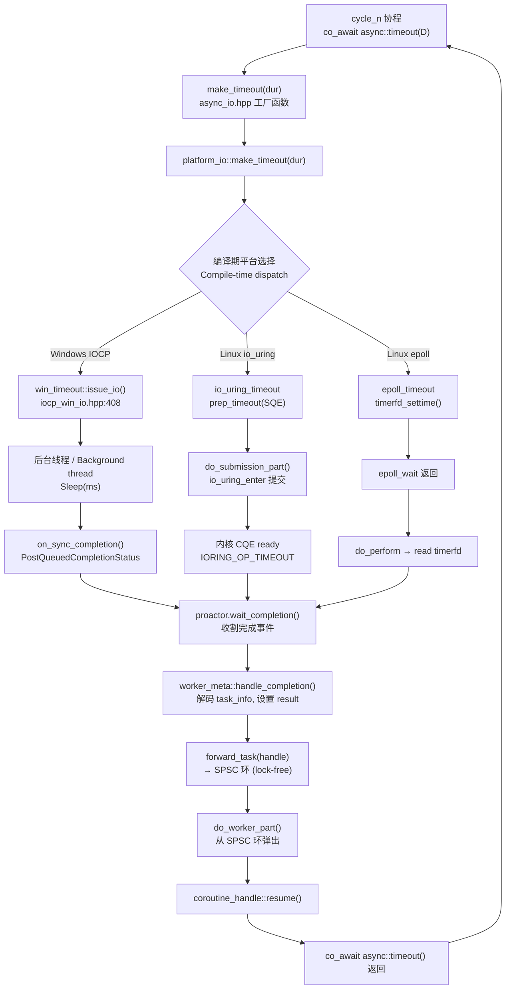
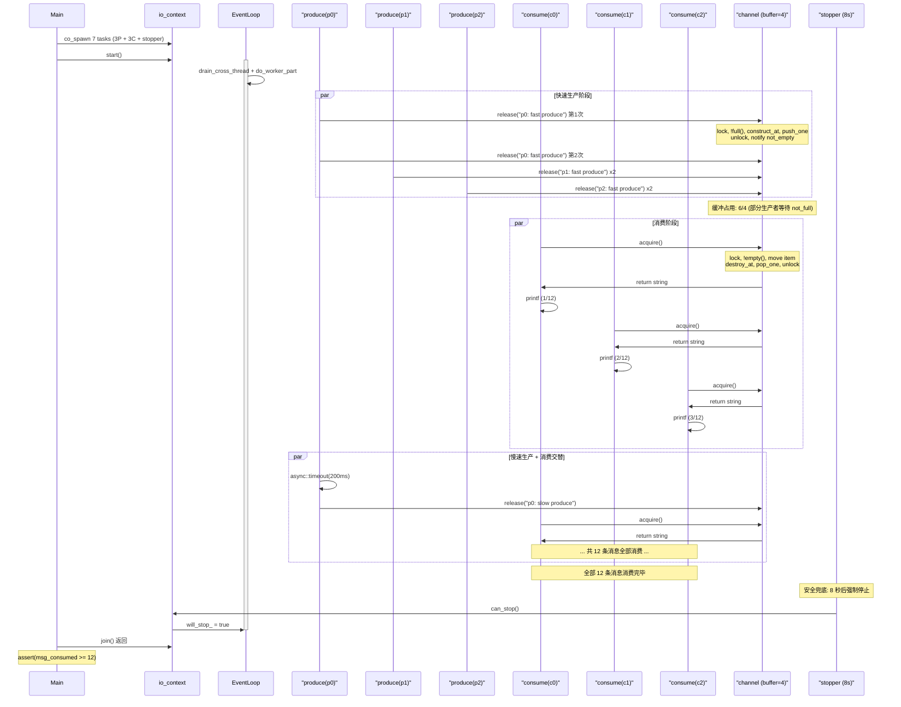
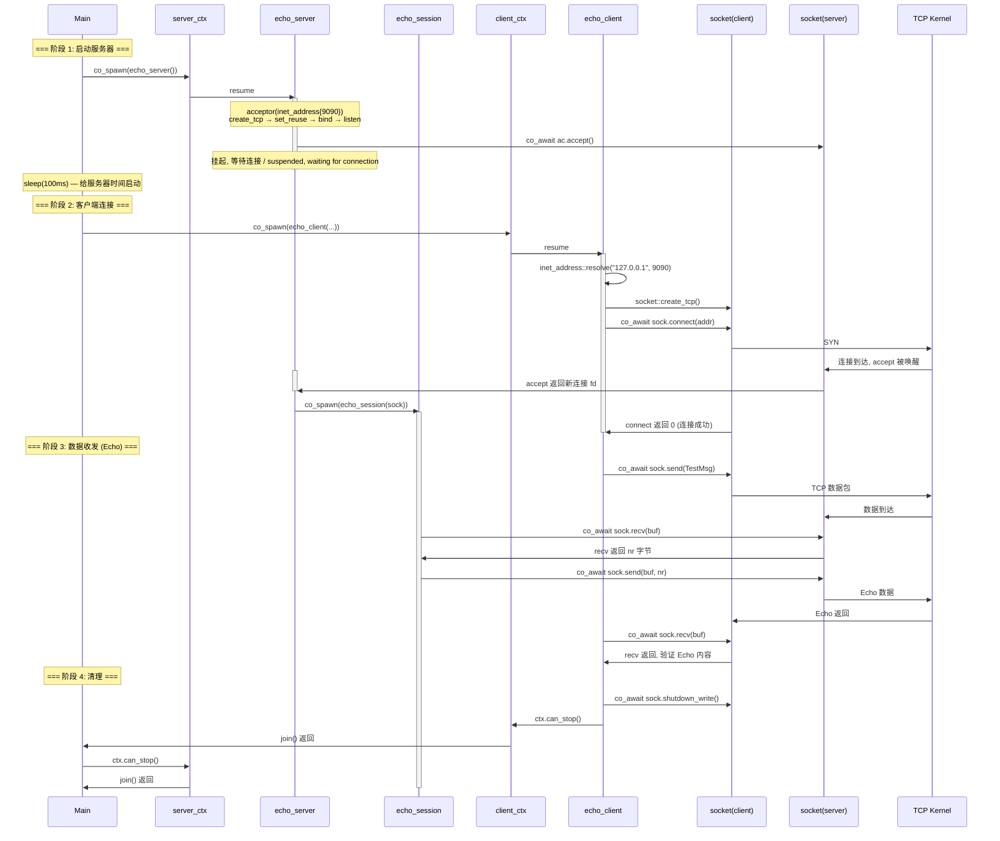
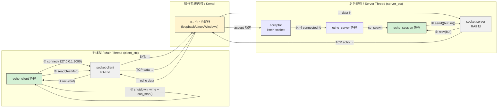

# coronet

**C++20 协程 · 跨平台 · 高性能异步 I/O 库**

<p align="center">
  
  
  
  
  
</p>

---

## ✨ 核心亮点

| 🎯 | 特性 | 说明 |
|:--:|------|------|
| 🔌 | **三后端热插拔** | epoll（默认）⇄ io_uring（`-DCORONET_IOURING=ON`）⇄ IOCP（Windows 自动） |
| 🖥️ | **全编译器跨平台** | Linux GCC 13 / Clang 18 + Windows MSVC 19.41，一套代码 |
| ⚡ | **编译期零开销多态** | CRTP + `#ifdef` 平台选择，无虚表、无堆分配 Proactor |
| 🔗 | **链式 co_await** | `co_await (recv && send)` 单次挂起完成两个 I/O 操作 |
| 🧵 | **协程同步原语** | mutex / condition_variable / semaphore / channel / when_all·any·some |
| 📊 | **统一压测驱动** | `stress_driver --server name:binary:port` 自动采集 RPS + CPU + 内存 |

## 🚀 性能速览

**Redis PING 服务, 100K 请求 × 50 并发, WSL2 epoll**

| 服务端 | RPS | CPU% | 内存 |
|--------|-----:|:---:|-----:|
| coronet ST (协程) | 19,952 | 83.6% | 3.9 MB |
| coronet chain (链式) | 14,051 | 87.1% | 3.9 MB |
| ASIO ST (回调) | 19,175 | 73.2% | 3.7 MB |

**三平台峰值 RPS（单线程）**

| 编译器 | coronet | 后端 |
|--------|-----:|------|
| MSVC 19.41 (Windows) | **58,384** 🏆 | IOCP |
| GCC 13.3 (Linux) | 48,662 | io_uring |
| Clang 18.1 (Linux) | 47,304 | io_uring |

> 完整报告 → [doc/aio_PR.md](doc/aio_PR.md) | 测试报告 → [doc/test_Report.md](doc/test_Report.md)

---

## ⚡ 快速开始

```bash
# 克隆
git clone https://github.com/lsqyling/coronet.git && cd coronet

# Linux — 默认 epoll 后端(Release)
cmake -S . -B build -G Ninja
    
cmake --build build
cd build && ctest --output-on-failure

# 切换到 io_uring
cmake -S . -B build-uring -G Ninja -DCORONET_IOURING=ON
cmake --build build-uring
ctest --test-dir build-uring --output-on-failure

# Windows MSVC (Developer Command Prompt)
cmake -S . -B build -G "Visual Studio 17 2022" -A x64
cmake --build build --config Release
ctest --test-dir build -C Release --output-on-failure

# Install coronet
cmake --install build --prefix D:/dev/local # windows msvc 
cmake --install build --prefix /usr/local    # linux 

# how to use
find_package(coronet REQUIRED)
add_executable(your_timer your_timer.cpp)
target_link_libraries(your_timer PRIVATE coronet::coronet)
```

## 📖 30 秒示例

### Echo Server

```cpp
#include <coronet/coronet.hpp>
using namespace coronet;

task<> session(int fd) {
    char buf[1024];
    while (true) {
        int n = co_await async::recv(fd, buf);
        if (n <= 0) break;
        co_await async::send(fd, {buf, (size_t)n});
    }
}

task<> server(uint16_t port) {
    acceptor ac{inet_address{port}};
    while (true)
        co_spawn(session(co_await ac.accept()));
}

int main() {
    io_context ctx;
    ctx.co_spawn(server(8080));
    ctx.start(); ctx.join();
}
```

### 同步原语

```cpp
// 互斥锁
mutex mtx;
task<> critical() {
    auto g = co_await mtx.lock_guard();
    /* 临界区 */
}

// 信号量 — 10 协程竞争 3 槽位
counting_semaphore sem{3};
task<> worker() { co_await sem.acquire(); /* ... */ sem.release(); }

// 条件变量
condition_variable cv; mutex m;
task<> waiter() {
    auto lk = co_await m.lock_guard();
    co_await cv.wait(m, [] { return ready; });
}

// CSP 通道 — 生产者/消费者
channel<std::string, 4> ch;
task<> producer() { co_await ch.release("msg"); }
task<> consumer() { auto s = co_await ch.acquire(); }
```

### 协程组合器 + 链式 I/O

```cpp
// 等待全部完成
auto [r0, r1] = co_await all(taskA(), taskB(), taskC());

// 首个完成者胜出
auto [idx, var] = co_await any(taskA(), taskB());

// 链式 co_await — 发送 PONG 同时接收下一条 PING
co_await (async::send(fd, pong) && async::recv(fd, buf));
```

---

## 🏗️ 架构

```
用户代码: task<> / shared_task<> / generator<>
   ↓ co_await
async::recv / send / accept / connect / timeout / ...
   ↓ 工厂函数 (编译期分派)
┌──────────┬──────────────┬──────────┐
│  epoll   │   io_uring   │   IOCP   │  ← 三后端, 编译期选择
│ (默认)   │ (CORONET_   │ (Windows │
│          │   IOURING=ON)│  自动)   │
└──────────┴──────────────┴──────────┘
   ↓
io_context (单线程事件循环)
   ├─ drain_cross_thread()   跨线程队列 → SPSC 环
   ├─ do_worker_part()       SPSC 环 → resume 协程
   ├─ do_submission_part()   提交 I/O (仅 io_uring)
   └─ do_completion_part()   收割完成事件
```

| 组件 | 职责 |
|------|------|
| `io_context` | 单线程事件循环，栈上 Proactor |
| `worker_meta` | SPSC 无锁环 + 跨线程队列 + I/O 计数器 |
| `task<T>` | 惰性协程，父链内联恢复（零调度开销） |
| `shared_task<T>` | 引用计数多等待者 |
| `epoll_awaiter_base<D>` | CRTP 编译期多态（非虚函数） |

---

## 📊 调用流程 / Call-Flow Diagrams

下面通过 Mermaid 时序图和数据流图展示 coronet 核心机制的运行时调用关系。

### 1. Fibonacci 生成器 — 协程生命周期

`test/generator_gtest.cpp` 中 Fibonacci 测试用例的完整调用时序。



---

### 2. 异步定时器 — 3 个并发定时器

`test/timer.cpp` 中启动 3 个定时器的测试。两个 1 秒定时器各运行 2 轮，一个 3 秒定时器运行 1 轮，外加 6 秒停止协程。





---

### 3. CSP 通道 — 3 生产者 / 3 消费者

`test/channel.cpp` 测试：3 个生产者各发送 4 条消息（2 条快速 + 2 条带 200ms 延迟），共 12 条消息被 3 个消费者并发消费。



---

### 4. TCP Echo 服务器/客户端 — 双线程 Echo

`examples/echo_server_client.cpp` 中服务器端和客户端的完整调用时序和数据流。





---

## 📦 CMake 选项

| 选项 | 默认 | 说明 |
|------|:---:|------|
| `CORONET_IOURING` | OFF | 启用 io_uring 替代 epoll |
| `CORONET_BUILD_TESTS` | ON* | 21 项单元+集成测试 (CTest) |
| `CORONET_BUILD_BENCHMARKS` | ON | Google Benchmark 微基准 |
| `CORONET_BUILD_STRESS_TESTS` | OFF | 压力测试 (redis-benchmark + redis_loadgen) |
| `CORONET_BUILD_EXAMPLES` | ON* | 示例程序 |

> \* `PROJECT_IS_TOP_LEVEL` 时默认 ON

---

## 🧪 CTest 测试矩阵

```bash
# 运行全部
ctest --output-on-failure -j4

# 分类运行
ctest -R gtest          # 单元测试 (18 用例)
ctest -R benchmark      # Google Benchmark
ctest -R stress_driver  # 压测 (ST / MT)
```

| 平台 / 编译器 | 后端 | 测试数 | 结果 |
|:---|:---|:---:|:---:|
| Linux GCC 13.3 | epoll | 22/22 | ✅ |
| Linux Clang 18.1 | epoll | 22/22 | ✅ |
| Linux GCC 13.3 | io_uring | 22/22 | ✅ |
| Windows MSVC 19.41 | IOCP | 21/21 | ✅ |

---

## 🔬 压力测试

```bash
# 构建
cmake -S . -B build -DCORONET_BUILD_STRESS_TESTS=ON
cmake --build build

# CTest 单线程对比
ctest -R stress_driver_ST

# 手动 — 自定义服务端
./stress_driver \
  --server "coronet_ST:redis_echo_ST:6380" \
  --server "ASIO_ST:redis_echo_asio_ST:6382" \
  -n 100000 -c 100 -v
```

添加新服务端**无需改 stress_driver 代码** — 在 CMakeLists 中追加 `--server name:binary:port` 即可。

---

## 📂 目录

```
coronet/
├── include/coronet/       # 公共头文件
│   ├── task.hpp           #   惰性协程
│   ├── async_io.hpp       #   跨平台 I/O 工厂
│   ├── io_context.hpp     #   事件循环
│   ├── net/               #   socket / acceptor
│   ├── co/                #   mutex / cv / sem / channel
│   ├── platform/          #   epoll / io_uring / IOCP
│   └── detail/            #   内部实现
├── src/coronet/           # .cpp 实现
├── test/                  # 21 项 CTest
├── bench/                 # Google Benchmark
├── stress-test/           # 压测驱动 + 服务端
├── examples/              # 示例程序
├── doc/                   # 性能报告 / API 手册
└── cmake/                 # CMake 模块
```

---

## 📜 许可

[Apache License](./LICENSE)
---

<sub>本项目代码由 **Claude Code** (Deepseek) 辅助生成，采用 AI Vibe Coding 开发方式。人工进行需求定义、架构设计审核、代码审查及测试验证。</sub>
